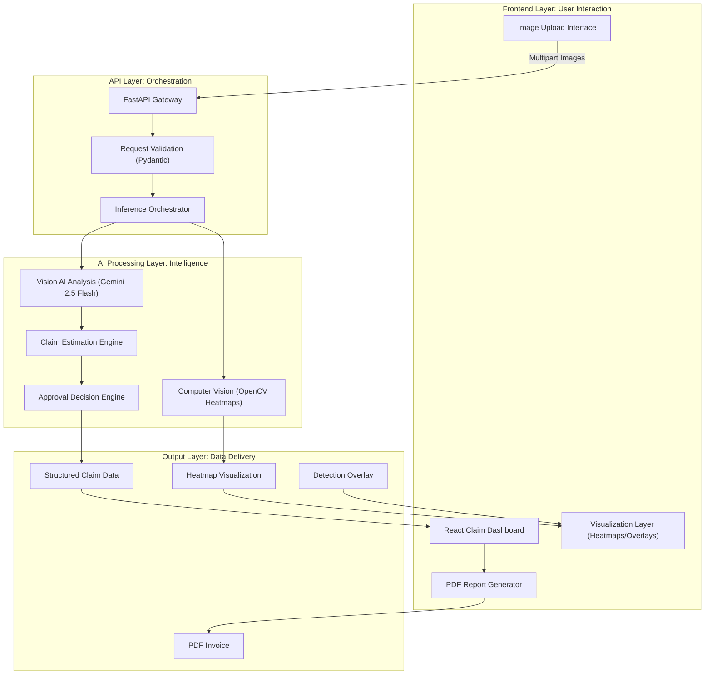

# 🚗 InsureClaim Vision

[](https://opensource.org/licenses/MIT)
[](https://ai.google.dev/)
[]()

**InsureClaim Vision** is an end-to-end, AI-powered motor insurance intelligence platform. It leverages **Google Gemini Vision AI** and **OpenCV** to automate vehicle damage assessment, transforming raw images into itemized repair estimates and instant claim decisions in seconds.

---

## 🚀 The Vision-to-Invoice Pipeline

Traditional insurance claims take days of manual inspection. InsureClaim Vision reduces this to seconds:
1. **Visual Reasoning:** Gemini Vision AI identifies damaged parts and assesses deformation severity.
2. **OpenCV Heatmapping:** Gradient-based analysis highlights damage clusters for human auditors.
3. **Dynamic Pricing:** A specialized engine calculates parts, labor, and GST based on severity.
4. **Instant Decisioning:** Automated logic flags fraud risk and provides pre-approval status.

---

## ✨ Key Features

| Feature | Technical Implementation |
|:---|:---|
| 🧠 **Gemini Vision AI** | Multi-image visual reasoning using Gemini 2.5 Flash for part identification. |
| 🔥 **Damage Heatmaps** | OpenCV gradient-processing to visualize impact intensity. |
| 🎯 **Detection Overlays** | Bounding boxes and confidence labels rendered via Canvas API. |
| 📋 **Intelligent Estimation** | Dynamic calculation of Repair vs. Replace costs + GST/Labour. |
| ✅ **Automated Approval** | Threshold-based logic for instant claim classification (Approved/Flagged). |
| 📄 **Professional PDF Export** | Auto-generated, download-ready claim invoices using `jsPDF`. |
| 🌙 **Next-Gen UI** | Dark-mode, glassmorphic dashboard built with React & Tailwind CSS. |

---

## 🏗️ System Architecture



---

## 🛠️ Tech Stack

* **Frontend:** React 18, TypeScript, Tailwind CSS, Framer Motion, Lucide Icons.
* **Backend:** Python 3.10+, FastAPI, Uvicorn.
* **Computer Vision:** OpenCV (cv2), NumPy, PIL.
* **AI/LLM:** Google Generative AI (Gemini 2.5 Flash).
* **Reporting:** jsPDF, AutoTable.

---

## 📂 Project Structure

```text
motor-claim-estimator/
├── 📂 backend/               # Python FastAPI Services
│   ├── main.py               # Server entry & routing
│   ├── cv_processor.py       # OpenCV Heatmap generation
│   ├── llm_agent.py          # Gemini Vision integration
│   ├── pricing_service.py    # Repair cost logic
│   └── models.py             # Pydantic schemas
├── 📂 frontend/              # React Application
│   ├── 📂 src/pages/         # Landing & Estimator Views
│   └── 📂 src/components/    # UI Modules (Heatmap, Overlays)
└── README.md

```

---

## 🚀 Installation & Setup

### 1. Prerequisites

* Python 3.10+ & Node.js 18+
* [Google AI Studio API Key](https://aistudio.google.com/)

### 2. Backend Setup

```bash
cd backend
pip install -r requirements.txt
# Create .env and add: GEMINI_API_KEY=your_key_here
python main.py

```

### 3. Frontend Setup

```bash
cd frontend
npm install
npm run dev

```

*Access the dashboard at `http://localhost:5173*`

---

## 📸 Screenshots

---


## 🔮 Future Roadmap

* [ ] **Fraud Detection:** Cross-referencing damage with historical claim data.
* [ ] **Severity Segmentation:** Pixel-perfect damage masks using SAM (Segment Anything Model).
* [ ] **Mobile Integration:** Dedicated iOS/Android app for on-site field agents.
* [ ] **Multi-Agent Workflow:** AI agents for automated communication with workshops.

---

## 👨‍💻 Author

**Bharath Chilaka**
*AI Engineer specializing in Computer Vision and Intelligent Automation Platforms.*

---

## ⚠️ Disclaimer

This platform is for **educational and demonstration purposes**. All AI-generated estimates must be verified by a licensed insurance surveyor before actual settlement.

---

**Built for the future of automated insurance intelligence.**
